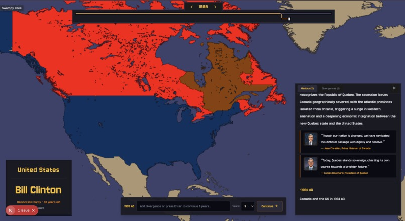
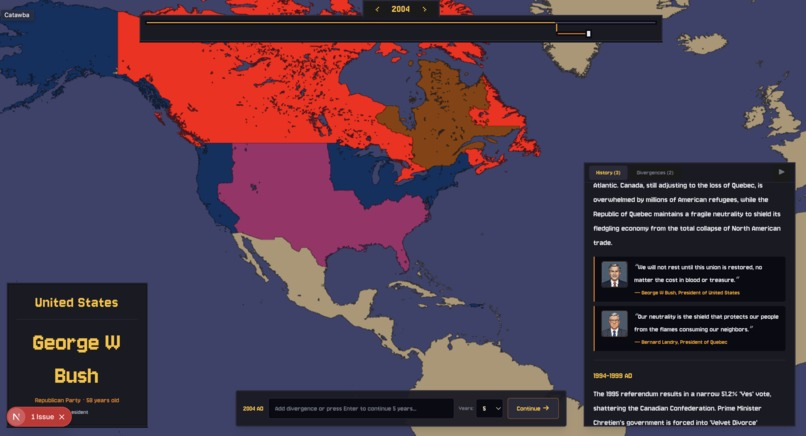
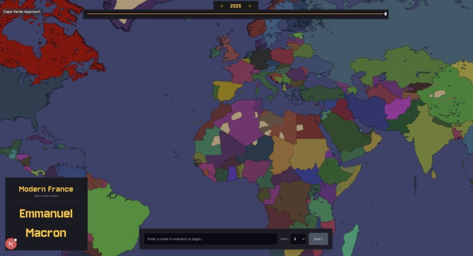
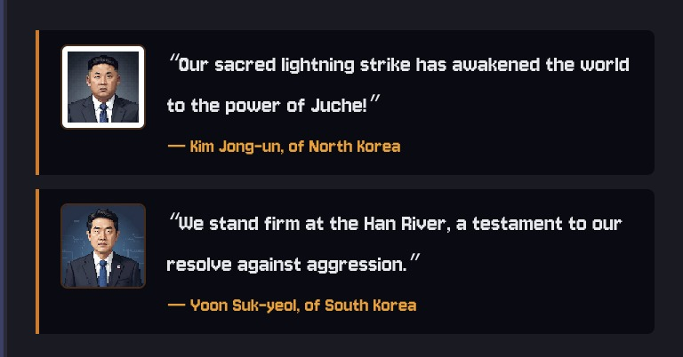

# Divergence

An alternate history simulator. Pick a starting point in history, type one "what if", and watch the next few decades play out on a world map.





*Above: "the 1995 Quebec referendum passes" — the map redraws as the simulation runs, and the panel on the right fills in with events and quotes from the people involved.*

## Why

I got into history during quarantine and ended up playing a lot of grand strategy games. The maps and the scope are great, but the AI running the other 200 countries is usually a handful of rules — attack the weak neighbour, ally the strong one. Run EU4 from 1444 to 1821 and you get a world that looks nothing like ours, not because of one interesting divergence but because everyone was playing badly for 400 years.

I wanted the opposite: a simulation where the world stays recognisable unless you change something, and where the thing you changed is what causes the mess. So instead of rules, the countries are driven by language models that actually know what happened, and the only reason history goes off the rails is you.

## What it does

You start from a scenario (currently the collapse of Rome, Canada/US from confederation, or the present day), type a divergence in plain English, and pick how many years to advance — 5, 10, 25 or 50. The simulation runs one step and streams results back as they arrive:

- a narrative of what happened over that period
- updated rulers for each country, with generated portraits
- one or two quotes from the leaders involved
- territorial changes, applied province by province on the map

Then you either continue (same timeline, next chunk of years) or type a new divergence to push it somewhere else. You can also queue several steps at once and let it run. Every step is snapshotted, so you can scrub the year slider back and forth and see the map at any point, and the timeline branches visibly where you intervened.



## How it works

The backend is a [LangGraph](https://langchain-ai.github.io/langgraph/) graph of six agents, all running Gemini models. One pass through the graph is one step of history.

| Agent | Model | Job |
| --- | --- | --- |
| **Filter** | `gemini-2.5-flash-lite` | Rejects divergences that don't fit the scenario or its date range, and picks the year the divergence starts from. |
| **Historian** | `gemini-2.5-flash-lite` | Reports what *actually* happened in the period, as conditional events ("if X was the situation, then Y happened"). It's deliberately kept blind to the alternate timeline so it stays a source of real history. Past the present day it extrapolates instead. |
| **Dreamer** | `gemini-3-flash-preview` | The one that makes decisions. Takes the real history, the accumulated divergences and the current rulers, and returns a narrative, new rulers, and a structured list of territorial changes. Also decides whether the timeline has merged back into real history. |
| **Geographer** | `gemini-3-flash-preview` | Turns the Dreamer's territorial changes into province ownership updates by calling tools against the map database. |
| **Quotegiver** | `gemini-2.5-flash-lite` | Writes one or two in-character quotes from the rulers who mattered this step. |
| **Illustrator** | `gemini-2.5-flash-image` | Generates pixel-art portraits for those rulers, cached and generated on a background thread pool so the request doesn't wait on them. |

Nothing after the Dreamer depends on anything but the Dreamer, so the graph runs Quotegiver and Geographer on two threads at once. The streaming endpoints the frontend actually uses step through the nodes one at a time instead, emitting a server-sent event as each finishes — that trades the parallelism for being able to show the narrative and the quotes while the map is still redrawing, which felt better than waiting on the whole step in silence.

Old steps get condensed into a running summary rather than replayed in full, which keeps the Dreamer's prompt from growing without limit as a timeline gets long.



### The geographer problem

This was the hard part. The map has about 5,000 provinces. You cannot hand a model a list of 5,000 province names and ask it to work out which ones "Quebec secedes" refers to — it doesn't fit in a sensible amount of context, and when it does fit the model hallucinates places that don't exist.

So the geographer never sees the whole map. Nearly 4,000 provinces are grouped into 924 named areas (Brittany, Lower Egypt, British Columbia — usually 5–7 provinces each), and those areas into 95 regions (France, Arabia, Canada). The agent gets the region list in its system prompt and drills down with tool calls:

```
"Quebec becomes independent"
  → query_region_areas("Canada")     # returns area names + who owns them
  → transfer_areas([...], "QUE")     # applies the change
  → mark_complete()
```

It works at the area level by default and only drops to individual provinces when it genuinely has to split one (coastal provinces only, that sort of thing). There are also shortcuts for the common sweeping cases — `annex_nation("BYZ", "ARB")` moves everything at once without enumerating anything. Territory that falls to a country the scenario doesn't track gets untracked rather than reassigned, so it renders as neutral land.

The result is that the agent's context stays small and every place name it sees is real, which is what stopped the hallucinated geography.

### Map rendering

The map is a WebGPU canvas, not SVG or tiles. A 5632×2304 grid of province IDs is baked into two uint16 textures — west and east halves, 13 MB each — and a compute shader recolours provinces by owner and draws borders on the GPU. That's what makes it possible to repaint thousands of provinces on every simulation step without the page stuttering. Province geometry and names are preprocessed from grand strategy game map data into those binaries plus JSON indices.

## Scenarios

| Scenario | Range | Notes |
| --- | --- | --- |
| Collapse of Rome | 116 – 1453 | Rome, and the eastern and western empires. |
| Canada and the US | 1868 – 2025 | Canada, the US, Quebec, and a federal-states-of-America tag. |
| Current Day | 2020 – 2025 | All 195 countries. Marked experimental — the more tags there are, the more the Dreamer has to keep straight. |

Scenarios are just directories under `backend/static/scenarios/`: a `metadata.json` with country tags, colours and a date range, `provinces.json` and `rulers.json` keyed by year, and a logo. Adding one doesn't require touching any code.

## Running it

You need Python 3.11+, Node 18+, a [Gemini API key](https://aistudio.google.com/apikey), and a browser with WebGPU. Chrome and Edge are the safe bets; anything without WebGPU will load the page but not the map.

**Backend**

```bash
cd backend
python -m venv .venv && source .venv/bin/activate
pip install -r requirements.txt
echo "GEMINI_API_KEY=your_key_here" > .env
uvicorn main:app --reload
```

Run it from inside `backend/` — the scenario and map data paths are relative to that directory. The API comes up on `http://localhost:8000`.

**Frontend**

```bash
cd frontend
npm install
npm run dev
```

Open `http://localhost:3000`. It defaults to `http://localhost:8000` for the API; set `NEXT_PUBLIC_API_URL` if your backend is somewhere else.

## Layout

```
backend/
  agents/            one file per agent, each with its own prompt and schema
  workflows/
    graph.py         the LangGraph wiring
    state.py         shared state passed between nodes
    nodes/           node wrappers around the agents
  api/               FastAPI routes, including the SSE streaming endpoints
  util/
    province_memory.py   province/area/region lookups and the live ownership state
    log_condenser.py     summarises old steps to keep prompts small
    portrait_cache.py    background portrait generation
  static/
    regions.json     95 regions → area names
    areas.json       924 areas → provinces
    scenarios/       one directory per scenario
frontend/
  src/components/    map canvas, timeline, panels
  src/lib/map-renderer/  WebGPU setup and viewport maths
  public/shaders/    the WGSL compute + render shaders
  public/*.bin       baked province ID textures
```

## Known limits

Games live in a dictionary in the backend process, so restarting the server drops every timeline in progress. There's no persistence and no auth.

The Dreamer sometimes describes a territorial change more vaguely than the Geographer can act on, and the change quietly doesn't land on the map. Portraits of the same ruler across steps aren't always consistent, since each one is generated independently.

## What's next

Stronger models for the Dreamer and Geographer, mainly for speed — a 50-year step with a full world scenario is slow. Finer-grained world state so smaller changes have somewhere to show up other than province ownership. And more starting points; the data pipeline handles any year, it's the scenario definitions that need writing.
